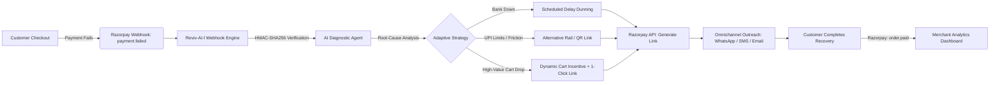

# ⚡ Reviv-AI-l *(pronounced "Revival")*

> **Autonomous Payment Failure Diagnosis & Adaptive Revenue Recovery Engine for Razorpay**  
> *Built for the **Razorpay AI Buildathon 2026 — Track 3: AI Revenue Recovery***

[](https://razorpay.com)
[](https://deepmind.google/technologies/gemini/)
[-brightgreen?style=flat-square)]()
[]()
[]()

---

## 🎯 The Problem: The High Cost of "Dumb" Dunning

In Indian digital commerce, **15% to 25% of transactions fail prematurely** due to:
1. **Issuer CBS Downtime:** HDFC, SBI, or ICICI core banking systems experiencing temporary gateway spikes.
2. **UPI Friction & Limits:** Daily VPA transaction ceilings exceeded or OTP timeouts.
3. **Cart Abandonment:** Shoppers facing minor friction and abandoning their carts without a fallback.

**The Status Quo:** Merchants either do **nothing** (losing GMV forever) or deploy **dumb dunning** (bombarding customers with immediate generic SMS reminders while the issuing bank is still down, leading to repeated failure loops and customer frustration).

---

## 💡 The Solution: Reviv-AI-l

**Reviv-AI-l** acts as an intelligent recovery sidecar for Razorpay merchants. It intercepts `payment.failed` webhook events in real-time, diagnoses the root cause using bank telemetry and error semantics, and orchestrates adaptive, high-conversion recovery workflows:

- 🛑 **Never Spams During Bank Outages:** Automatically delays outreach until bank health normalizes.
- ⚡ **Autonomous Tool Execution:** Instantly provisions dynamic Razorpay Payment Links & Smart QR codes with 1-click checkout.
- 🎁 **Incentivized Recovery:** Dynamically applies authorized recovery discounts (e.g. 5% off) for high-value carts to incentivize immediate completion.
- 📊 **Real-Time Financial Dashboard:** Tracks At-Risk Revenue vs. Recovered Revenue, conversion rates, and live agent reasoning logs.

---

## 🏗️ System Architecture



---

## ⚖️ Built for Razorpay's 4 Evaluation Pillars

| Evaluation Pillar | How Reviv-AI-l Delivers |
| :--- | :--- |
| **1. Problem Taste** | Directly attacks the single biggest leak in the fintech conversion funnel (failed checkouts), unlocking lost Gross Merchandise Value (GMV) for merchants and Razorpay. |
| **2. Build Quality** | Complete full-stack implementation with HMAC webhook verification, database persistence, real Razorpay API link generation, and live WebSocket telemetry. |
| **3. AI Judgment** | Strategic deployment of LLMs: AI is strictly applied to natural language diagnosis, failure semantic classification, and empathetic messaging, while financial math and payment execution remain deterministic. |
| **4. Failure Recovery** | Built-in circuit breakers, idempotent retry keys, fallback heuristic matrix when LLMs are unavailable, and bank downtime delay scheduling. |

---

## 📂 Project Structure

```text
reviv-ai-l/
├── docs/
│   └── SRS.md                 # Complete IEEE 830 Software Requirements Specification
├── src/                       # Application source code
│   ├── config.py              # Dual-mode configuration (Live vs. Simulation)
│   ├── database.py            # SQLite engine and session management
│   ├── models.py              # Transaction, RecoveryAttempt, BankTelemetry, AuditLog
│   ├── telemetry.py           # Real-time issuer bank health telemetry
│   ├── webhook.py             # HMAC-SHA256 signature verification & event parser
│   ├── agent.py               # AI Diagnostic Engine (Gemini Flash + Heuristic Core)
│   ├── orchestrator.py        # Razorpay Payment Link generator & dunning dispatcher
│   └── main.py                # FastAPI app, WebSockets broadcaster, REST endpoints
├── static/                    # Frontend assets
│   ├── index.html             # Real-time Merchant Command Center UI
│   └── app.js                 # WebSocket client, simulator controls, modal viewer
├── tests/                     # Automated test suites (8/8 passing)
│   ├── test_agent.py          # Diagnostic classification & discount tests
│   ├── test_orchestrator.py   # Payment link creation & status transition tests
│   └── test_webhook.py        # HMAC-SHA256 signature validation tests
├── demo.py                    # Standalone CLI webhook runner
├── requirements.txt           # Python dependencies
├── conftest.py                # Pytest configuration
├── .gitignore
└── README.md
```

---

## 🚀 Quickstart & Demo Walkthrough

### 1. Setup Virtual Environment
```powershell
python -m venv .venv
.\.venv\Scripts\pip install -r requirements.txt
```

### 2. Run Automated Verification Tests
```powershell
.\.venv\Scripts\python.exe -m pytest tests/ -v
```
*(All 8 tests pass covering HMAC cryptography, taxonomy classification, and recovery transitions.)*

### 3. Launch the Server
```powershell
.\.venv\Scripts\uvicorn.exe src.main:app --reload --port 8000
```
Open **`http://localhost:8000`** in your browser.

### 4. Interactive Live Demo for Judges
1. **Trigger Scenario A (Bank Downtime):** Click *"Scenario A: SBI CBS Downtime"*. The AI agent detects bank server lag, classifies it as `BANK_DOWNTIME_TRANSIENT`, and enforces a 15-minute retry delay rather than spamming the user.
2. **Trigger Scenario B (UPI Daily Limit):** Click *"Scenario B: Daily UPI Ceiling Exceeded"*. The AI classifies it as `USER_LIMIT_EXCEEDED` and generates a card/netbanking fallback link.
3. **Trigger Scenario C (High Cart Friction):** Click *"Scenario C: High-Cart OTP Dropoff"*. Cart value is ₹8,999; the agent detects friction and automatically attaches a **5% dynamic recovery incentive** to close the sale.
4. **Preview Customer Outreach:** Click *"Preview Outreach"* on any card to view the simulated WhatsApp message and 1-click checkout button.
5. **Recover Revenue:** Click *"Simulate Customer Pay"*. Observe the At-Risk GMV shift to **Recovered GMV** in real time!

---

## 📜 Full Documentation
For the detailed IEEE 830 specification, see [docs/SRS.md](docs/SRS.md).

---

## 📄 License
This project is open-source under the [MIT License](LICENSE).
