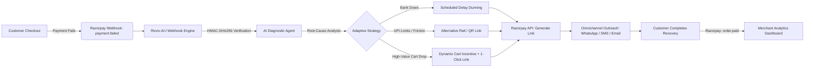

# ⚡ Reviv-AI-l *(pronounced "Revival")*

> **Autonomous Payment Failure Diagnosis & Adaptive Revenue Recovery Engine for Razorpay**  
> *Built for the **Razorpay AI Buildathon 2026 — Track 3: AI Revenue Recovery***

[](https://razorpay.com)
[](https://deepmind.google/technologies/gemini/)
[]()
[]()

---

## 🎯 The Problem: The High Cost of "Dumb" Dunning

In Indian digital commerce, **15% to 25% of transactions fail prematurely** due to:
1. **Issuer CBS Downtime:** HDFC, SBI, or ICICI core banking systems experiencing temporary gateway spikes.
2. **UPI Friction & Limits:** Daily VPA transaction ceilings exceeded or OTP timeouts.
3. **Cart Abandonment:** Shoppers facing minor friction and abandoning their carts without a fallback.

**The Status Quo:** Merchants either do **nothing** (losing GMV forever) or deploy **dumb dunning** (bombarding customers with immediate generic SMS reminders while the issuing bank is still down, leading to repeated failure loops and customer frustration).

---

## 💡 The Solution: Reviv-AI-l

**Reviv-AI-l** acts as an intelligent recovery sidecar for Razorpay merchants. It intercepts `payment.failed` webhook events in real-time, diagnoses the root cause using bank telemetry and error semantics, and orchestrates adaptive, high-conversion recovery workflows:

- 🛑 **Never Spams During Bank Outages:** Automatically delays outreach until bank health normalizes.
- ⚡ **Autonomous Tool Execution:** Instantly provisions dynamic Razorpay Payment Links & Smart QR codes with 1-click checkout.
- 🎁 **Incentivized Recovery:** Dynamically applies authorized recovery discounts (e.g. 5% off) for high-value carts to incentivize immediate completion.
- 📊 **Real-Time Financial Dashboard:** Tracks At-Risk Revenue vs. Recovered Revenue, conversion rates, and live agent reasoning logs.

---

## 🏗️ System Architecture



---

## ⚖️ Built for Razorpay's 4 Evaluation Pillars

| Evaluation Pillar | How Reviv-AI-l Delivers |
| :--- | :--- |
| **1. Problem Taste** | Directly attacks the single biggest leak in the fintech conversion funnel (failed checkouts), unlocking lost Gross Merchandise Value (GMV) for merchants and Razorpay. |
| **2. Build Quality** | Complete full-stack implementation with HMAC webhook verification, database persistence, real Razorpay API link generation, and live WebSocket telemetry. |
| **3. AI Judgment** | Strategic deployment of LLMs: AI is strictly applied to natural language diagnosis, failure semantic classification, and empathetic messaging, while financial math and payment execution remain deterministic. |
| **4. Failure Recovery** | Built-in circuit breakers, idempotent retry keys, fallback heuristic matrix when LLMs are unavailable, and bank downtime delay scheduling. |

---

## 📂 Project Structure

```text
reviv-ai-l/
├── docs/
│   └── SRS.md                 # Complete IEEE 830 Software Requirements Specification
├── src/                       # Application source code
├── tests/                     # Automated test suites
├── .gitignore
├── README.md
└── package.json / pyproject   # Dependencies
```

---

## 🚀 Quickstart

### Prerequisites
- Node.js 20+ / Python 3.11+
- Razorpay Test Account ([Dashboard](https://dashboard.razorpay.com/))
- Gemini API Key ([Google AI Studio](https://aistudio.google.com/))

### Configuration
Create a `.env` file in the root directory:
```env
RAZORPAY_KEY_ID=rzp_test_your_key_id
RAZORPAY_KEY_SECRET=your_key_secret
RAZORPAY_WEBHOOK_SECRET=your_webhook_secret
GEMINI_API_KEY=your_gemini_api_key
PORT=3000
```

---

## 📜 Documentation
For detailed system architecture, API contracts, entity-relationship diagrams, and state machines, see [docs/SRS.md](docs/SRS.md).

---

## 📄 License
This project is open-source under the [MIT License](LICENSE).
