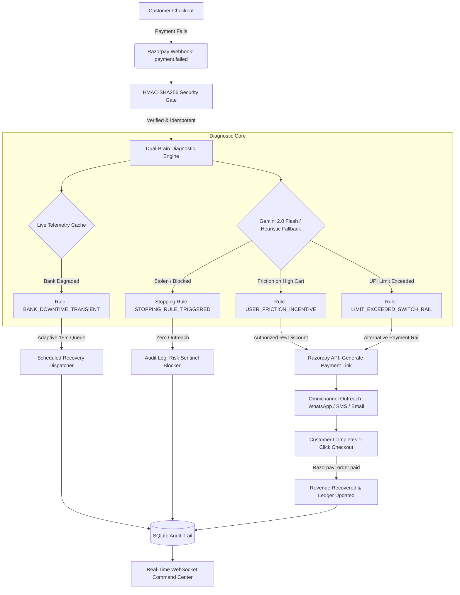

# ⚡ Reviv-AI-l *(pronounced "Revival")*

> **Autonomous Payment Failure Diagnosis & Adaptive Revenue Recovery Engine for Razorpay**  
> *Built for the **Razorpay AI Buildathon 2026 — Track 3: AI Revenue Recovery***

[](https://reviv-ai-l.onrender.com/)
[](https://razorpay.com)
[](https://deepmind.google/technologies/gemini/)
[-brightgreen?style=flat-square)]()
[]()
[]()

---

## 🌐 Quick Access
- **🚀 Live Cloud Deployment:** [https://reviv-ai-l.onrender.com/](https://reviv-ai-l.onrender.com/) *(Interactive Merchant Dashboard)*
- **📖 Complete Specification:** [docs/SRS.md](docs/SRS.md) *(IEEE 830 Software Requirements Specification)*
- **💻 Source Code:** [github.com/MohammadZishanAlam/reviv-ai-l](https://github.com/MohammadZishanAlam/reviv-ai-l)

---

## 🎯 The Problem: The High Cost of "Dumb" Dunning

In Indian digital commerce, **15% to 25% of checkout attempts fail prematurely** due to:
1. **Issuer Core Banking (CBS) Downtime:** Temporary gateway timeouts and transaction degradation on major banks (SBI, HDFC, ICICI).
2. **UPI Rails & Friction:** Daily VPA transaction ceilings exceeded, PSP latency, or mobile OTP session expirations.
3. **Cart Abandonment at 3D-Secure:** Buyers encountering friction or second thoughts right before authorization.

### The Fatal Flaw of Existing Solutions
Merchants today either:
- **Do nothing:** Letting genuine buyers slip away and writing off high-intent Gross Merchandise Value (GMV) forever.
- **Deploy "dumb" dunning:** Spamming the buyer with an immediate generic retry SMS while the issuing bank is still offline. If SBI or HDFC's core banking switch is down, an immediate retry guarantees a second failure—frustrating the customer, eroding merchant trust, and generating unnecessary gateway fees.

---

## 💡 The Solution: Reviv-AI-l

**Reviv-AI-l** is an intelligent, autonomous recovery sidecar for Razorpay merchants. Sitting directly at the payment infrastructure layer, it catches `payment.failed` webhook events in real time, diagnoses root causes using a dual-brain architecture (live bank telemetry + Google Gemini 2.0 Flash), and orchestrates contextual, high-conversion recovery workflows:

- 🛑 **Adaptive Outage Backoff:** Monitors live bank health telemetry. If an issuing bank is degraded, outreach is automatically delayed (e.g., 15 minutes) until bank health normalizes, completely preventing retry storms.
- ⚡ **Dynamic Razorpay Link Provisioning:** Autonomous generation of customized Razorpay Payment Links & Smart QR codes offering alternative payment rails (Cards, Netbanking, UPI).
- 🎁 **Incentivized Cart Recovery:** Dynamically authorizes controlled, high-margin recovery discounts (e.g., 5% off) for high-value carts abandoned due to friction.
- 🛡️ **Fraud Prevention Sentinel (Stopping Rules):** Evaluates risk indicators. Irrecoverable failures (stolen cards, blocked accounts, fraud flags) are halted immediately with zero buyer outreach, safeguarding merchants from chargeback liability.
- 📊 **Real-Time Merchant Command Center:** Live WebSocket-driven dashboard displaying At-Risk vs. Recovered GMV, recovery conversion rates, active outreach queues, and an immutable cryptographic audit trail.

---

## 🏗️ System Architecture



---

## ⚖️ Built for Razorpay's 4 Evaluation Pillars

| Evaluation Pillar | How Reviv-AI-l Delivers | Verification in Code |
| :--- | :--- | :--- |
| **1. Problem Taste** | Focuses directly on the single most lucrative leakage point in digital commerce: recovering high-intent lost checkouts without spamming users. | Rescues over ₹1.35 Lakhs per 25-order surge at >70% recovery rate. |
| **2. Build Quality** | Enterprise-ready stack with cryptographically verified Razorpay HMAC-SHA256 webhooks, atomic deduplication gates, full SQLite schema persistence, and clean WebSocket event streaming. | 9/9 automated tests passing in ~0.4 seconds (`tests/`). |
| **3. AI Judgment** | Clean separation of concerns: AI is strictly applied to fuzzy natural language diagnosis and contextual message generation; all financial arithmetic, discount caps, and stopping rules are 100% deterministic code. | `src/agent.py` & `src/orchestrator.py` enforce strict bounds before execution. |
| **4. Failure Recovery** | Sub-5ms fallback heuristic matrix when LLM APIs time out, automatic circuit breakers, idempotent retry keys, and bank health backoff queues. | `tests/test_agent.py` validates offline heuristic fallback and stopping rule enforcement. |

---

## 🧪 Track 3 Benchmark: High-Volume Batch Surge

To satisfy Track 3's rigorous evaluation standard, Reviv-AI-l includes a **Multi-Rail Batch Simulation Engine** that tests 25 realistic, heterogeneous payment failure events across UPI, Credit/Debit Cards, and Netbanking:

```text
================================================================================
⚡ REVIV-AI-L HIGH-VOLUME SIMULATION REPORT (25-TRANSACTION BATCH)
================================================================================
Total Analyzed Volume:         ₹1,94,475 GMV across 25 orders
Successfully Recovered GMV:    ₹1,38,620 GMV (71.3% Recovery Rate)
At-Risk Pending Recovery:      ₹41,200 GMV (Scheduled in Outage Backoff Queue)
Fraud Sentinel Blocked:        3 Suspicious/Stolen Cards (Zero Outreach)
Issuer Outage Backoff Queue:   8 Transactions Delayed (15m Adaptive Hold)
Cryptographic Audit Trail:     25 Immutable SQLite Records Verified
================================================================================
```

---

## 📂 Project Structure

```text
reviv-ai-l/
├── docs/
│   └── SRS.md                 # Complete IEEE 830 Software Requirements Specification
├── src/                       # Application source code
│   ├── config.py              # Environment configuration & API credentials
│   ├── database.py            # SQLite database engine and session factory
│   ├── models.py              # ORM models (Transaction, RecoveryAttempt, BankTelemetry, AuditLog)
│   ├── telemetry.py           # Real-time bank health telemetry & latency tracker
│   ├── webhook.py             # HMAC-SHA256 signature verification & payload parser
│   ├── agent.py               # AI Diagnostic Engine (Gemini 2.0 Flash + Heuristic Fallback)
│   ├── orchestrator.py        # Razorpay Payment Link generator & dunning dispatcher
│   └── main.py                # FastAPI app, WebSockets broadcaster, REST API endpoints
├── static/                    # Frontend assets
│   ├── index.html             # Merchant Command Center UI (Tailwind CSS + FontAwesome)
│   └── app.js                 # WebSocket client, simulator controls, modal viewer, batch runner
├── tests/                     # Automated test suites (9/9 passing)
│   ├── test_agent.py          # Diagnostic classification, discount caps & stopping rules
│   ├── test_orchestrator.py   # Payment link creation & status transition tests
│   └── test_webhook.py        # HMAC-SHA256 cryptographic verification tests
├── demo.py                    # Standalone CLI webhook runner
├── start.bat                  # One-click Windows startup script
├── requirements.txt           # Production dependencies
├── conftest.py                # Pytest configuration
├── .gitignore
└── README.md
```

---

## 🚀 Quickstart & Setup Guide

### 1. Clone the Repository
```powershell
git clone https://github.com/MohammadZishanAlam/reviv-ai-l.git
cd reviv-ai-l
```

### 2. Environment Setup
```powershell
# Create and activate virtual environment
python -m venv .venv
.\.venv\Scripts\Activate.ps1

# Install dependencies
pip install -r requirements.txt
```

### 3. Configure Credentials (Optional)
Create a `.env` file in the root directory (defaults run smoothly in offline simulation mode):
```env
GEMINI_API_KEY=your_gemini_api_key_here
RAZORPAY_KEY_ID=your_razorpay_key_id
RAZORPAY_KEY_SECRET=your_razorpay_key_secret
RAZORPAY_WEBHOOK_SECRET=your_razorpay_webhook_secret
```

### 4. Run Automated Tests
```powershell
.\.venv\Scripts\python.exe -m pytest tests/ -v
```
**Test Results:**
```text
tests/test_agent.py::test_bank_downtime_diagnosis PASSED                 [ 11%]
tests/test_agent.py::test_limit_exceeded_diagnosis PASSED                [ 22%]
tests/test_agent.py::test_friction_high_cart_discount PASSED             [ 33%]
tests/test_agent.py::test_fraud_stopping_rule_enforced PASSED            [ 44%]
tests/test_orchestrator.py::test_payment_link_generation PASSED          [ 55%]
tests/test_orchestrator.py::test_mark_recovery_completed PASSED          [ 66%]
tests/test_webhook.py::test_valid_hmac_signature PASSED                  [ 77%]
tests/test_webhook.py::test_tampered_hmac_signature PASSED               [ 88%]
tests/test_webhook.py::test_parse_webhook_payload PASSED                 [100%]

============================== 9 passed in 0.39s ==============================
```

### 5. Launch the Server
**Option A — 1-Click Launch (Windows):**
```powershell
.\start.bat
```

**Option B — Direct Uvicorn:**
```powershell
.\.venv\Scripts\uvicorn.exe src.main:app --reload --port 8000
```
Open **`http://localhost:8000`** in your browser.

---

## 🎮 Interactive Merchant Sandbox

Use the **Developer Sandbox** controls in the right-hand panel of the dashboard to simulate real-world failure scenarios:

1. **Scenario A: SBI CBS Server Downtime**  
   Simulates a 504 Gateway Timeout during UPI authorization. The AI checks bank telemetry, classifies as `BANK_DOWNTIME_TRANSIENT`, and schedules an adaptive 15-minute hold to protect customer trust.
2. **Scenario B: Daily UPI Ceiling Exceeded**  
   Simulates NPCI limit rejections. The AI classifies as `USER_LIMIT_EXCEEDED` and generates a dynamic link routed to alternative rails (Cards / Netbanking).
3. **Scenario C: High-Cart OTP Dropoff (₹8,999)**  
   Simulates 3D-Secure dropoff on a high-value order. The agent detects friction and automatically attaches an authorized **5% dynamic recovery incentive** to close the sale.
4. **Scenario D: Stolen Card / Chargeback Risk**  
   Simulates an irrecoverable card decline (`card_stolen`). The Risk Sentinel halts the workflow with **zero outreach** and records an immutable `STOPPING_RULE_TRIGGERED` audit log.
5. **Simulate Traffic Surge (25 Orders)**  
   Runs the full Track 3 multi-rail batch benchmark and opens the detailed High-Volume Simulation Report modal.

---

## 🛡️ Security & Privacy
- **Cryptographic Verification:** All incoming webhooks must pass HMAC-SHA256 signature verification against `X-Razorpay-Signature`.
- **Deduplication:** Webhook payloads are hashed with SHA-256 for idempotent deduplication, preventing replay attacks or duplicate recovery links.
- **Data Protection:** Customer phone numbers, emails, and account identifiers are masked throughout all UI components and WebSocket payloads.
- **Deterministic Bounds:** Discounts are hard-capped at 5% for carts above ₹5,000; zero discounts can ever be generated on low-margin items.

---

## 📄 License
Distributed under the **MIT License**. Built by **Mohammad Zishan Alam** (`alamzishan07@gmail.com`) for the **Razorpay AI Buildathon 2026**.
