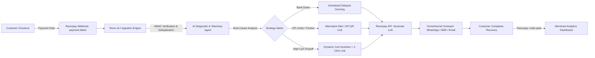
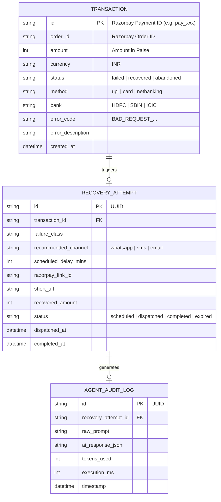
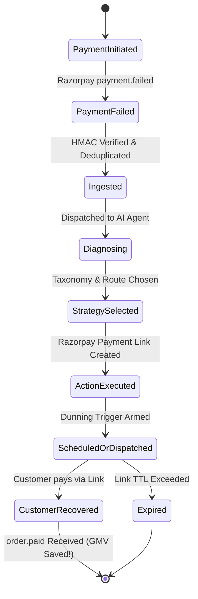

# Software Requirements Specification (SRS)
## Project: Reviv-AI-l (Autonomous Payment Failure Diagnosis & Adaptive Revenue Recovery)
**Competition Track:** Razorpay AI Buildathon 2026 — Track 3: AI Revenue Recovery  
**Document Version:** 1.0.0  
**Date:** September 3, 2026  
**Status:** Approved for Implementation  

---

## Table of Contents
1. [Introduction](#1-introduction)
   - 1.1 Purpose
   - 1.2 Document Conventions
   - 1.3 Intended Audience
   - 1.4 Project Scope
   - 1.5 System Vision & Value Proposition
2. [Overall Description](#2-overall-description)
   - 2.1 Product Perspective
   - 2.2 System Context & High-Level Architecture
   - 2.3 User Classes and Personas
   - 2.4 Operating Environment
   - 2.5 Design & Implementation Constraints
   - 2.6 Assumptions and Dependencies
3. [System Features & Functional Requirements](#3-system-features--functional-requirements)
   - 3.1 Module 1: Webhook Ingestion & Signature Verification
   - 3.2 Module 2: AI Diagnostic & Root-Cause Classification Engine
   - 3.3 Module 3: Adaptive Dunning & Recovery Action Orchestrator
   - 3.4 Module 4: Razorpay API Tool Calling & Link Generation
   - 3.5 Module 5: Merchant Analytics & Telemetry Dashboard
   - 3.6 Module 6: End-to-End Failure Simulation Sandbox
4. [External Interface Requirements](#4-external-interface-requirements)
   - 4.1 User Interfaces (Merchant Web Application)
   - 4.2 Software & API Interfaces (Razorpay, LLM Provider)
   - 4.3 Communication Protocols & Security (HMAC, HTTPS, WebSockets)
5. [Non-Functional Requirements (NFRs)](#5-non-functional-requirements-nfrs)
   - 5.1 Performance & Latency
   - 5.2 Security & PCI-DSS Scoping
   - 5.3 Reliability, Idempotency & Fault Tolerance
   - 5.4 AI Guardrails & Hallucination Mitigation
6. [Data Model & State Specifications](#6-data-model--state-specifications)
   - 6.1 Entity-Relationship Specification
   - 6.2 Transaction Lifecycle State Machine
7. [Verification & Acceptance Criteria](#7-verification--acceptance-criteria)

---

## 1. Introduction

### 1.1 Purpose
This Software Requirements Specification (SRS) defines the complete software, architectural, and behavioral requirements for **Reviv-AI-l** (*pronounced "Revival"*). Reviv-AI-l is an autonomous payment failure interception, root-cause diagnostic, and adaptive multi-channel dunning system purpose-built for merchants integrating with **Razorpay**. This document serves as the primary technical specification for design, development, evaluation, and judging verification.

### 1.2 Document Conventions
- **MUST / SHALL:** Mandatory requirement.
- **SHOULD:** Highly recommended requirement; failure to implement will degrade performance or judging rubric scores.
- **MAY:** Optional or future scope feature.

### 1.3 Intended Audience
- Hackathon Judges & Evaluators at Razorpay.
- System Architects, Full-Stack Engineers, and AI Integration Specialists.
- Merchant Growth, Operations, and Finance Stakeholders.

### 1.4 Project Scope
Reviv-AI-l intercepts real-time transaction failures emitted by Razorpay (`payment.failed`, `order.paid`, `subscription.halted`). It circumvents traditional "dumb" dunning mechanisms (which bombard customers with immediate, generic messages even during bank network downtime) by employing an **AI Diagnostic Engine** powered by Google Gemini and real-time bank telemetry. The engine dynamically diagnoses failure semantics, determines the optimal intervention channel and timing, generates actionable recovery instruments (dynamic Razorpay Payment Links, UPI AutoPay triggers, or smart discount vouchers), and tracks financial recovery through a merchant dashboard.



---

## 2. Overall Description

### 2.1 Product Perspective
In digital commerce in India, approximately 15% to 25% of all digital checkouts terminate prematurely due to transient bank Core Banking System (CBS) downtime, user session timeouts, OTP delays, or insufficient limits. Reviv-AI-l operates as an intelligent sidecar/middleware attached to a merchant’s Razorpay account.

### 2.2 System Context & High-Level Architecture
The system consists of five decoupled layers:
1. **Event Ingestion Gateway:** Fast HTTP listener with cryptographic HMAC verification and idempotency locks.
2. **Telemetry & Bank Health Cache:** Tracks real-time success rates across major Indian issuers (HDFC, SBI, ICICI, Axis) to prevent retry storms during outages.
3. **AI Diagnostic Core:** Structured LLM agent applying few-shot error taxonomy and heuristic scoring to select intervention workflows.
4. **Action Engine (Tool Calling):** Direct integration with Razorpay REST APIs (`/v1/payment_links`, `/v1/orders`, `/v1/invoices`).
5. **Real-Time Reactive UI:** Merchant dashboard featuring live socket feeds, recovery metrics, and a failure simulation sandbox for demonstrations.

### 2.3 User Classes and Personas
1. **Merchant / E-Commerce Store Owner:**
   - Wants to reclaim lost revenue without annoying shoppers.
   - Monitors recovery rate, revenue saved, and downtime telemetry.
2. **End Consumer / Shopper:**
   - Faces a broken payment experience.
   - Receives clear, respectful, context-aware assistance with a 1-click fallback link.
3. **Hackathon Judge / Developer Evaluator:**
   - Requires transparent proof of execution: live webhook logs, tool execution records, and state transitions.

### 2.4 Operating Environment
- **Runtime:** Node.js (v20+ LTS) or Python (3.11+).
- **Database:** SQLite (local development/demo portability) or PostgreSQL.
- **Frontend:** Next.js 14/15, React 19, Tailwind CSS, shadcn/ui.
- **External Dependencies:** Razorpay Payments API (v1), Google Gemini API (`@google/genai` or `google-genai`).

### 2.5 Design & Implementation Constraints
- **Zero Raw Card Data Handling:** System strictly complies with PCI-DSS guidelines by never processing or persisting PANs or CVVs. Only Razorpay tokens, payment IDs, and error codes are processed.
- **Strict HMAC Verification:** Every inbound webhook must be validated using `crypto.createHmac('sha256', secret)`.

---

## 3. System Features & Functional Requirements

### 3.1 Module 1: Webhook Ingestion & Signature Verification
- **FR-1.1:** The system **MUST** expose an endpoint `/api/webhooks/razorpay` listening for HTTP POST requests.
- **FR-1.2:** The system **MUST** extract `X-Razorpay-Signature` from incoming headers and verify it against the raw request body using the configured webhook secret.
- **FR-1.3:** If signature verification fails, the system **MUST** respond immediately with HTTP 400 and log a security violation.
- **FR-1.4:** The system **MUST** implement idempotency checks using the `event_id` or `payment.id` to prevent duplicate processing of re-delivered webhooks.
- **FR-1.5:** The system **MUST** respond with HTTP 200 within 2000ms to acknowledge receipt to Razorpay, queuing the analysis asynchronously if needed.

### 3.2 Module 2: AI Diagnostic & Root-Cause Classification Engine
- **FR-2.1:** The engine **MUST** ingest the raw `payment.failed` entity containing:
  - `error_code`, `error_description`, `error_source`, `error_step`, `error_reason`.
  - `method` (upi, card, netbanking, wallet).
  - `bank` (e.g., `HDFC`, `SBIN`, `ICIC`).
  - `amount`, `currency`, `contact`, `email`.
- **FR-2.2:** The AI agent **MUST** categorize each failure into one of five predefined taxonomy classes:
  1. `BANK_DOWNTIME_TRANSIENT`: Issuer CBS or switch failure (`GATEWAY_ERROR`, `BANK_SYSTEM_ERROR`).
  2. `USER_LIMIT_EXCEEDED`: Daily UPI/card transaction ceiling breached.
  3. `AUTH_FRICTION_TIMEOUT`: OTP delay, user cancellation, or session timeout.
  4. `PAYMENT_METHOD_INELIGIBLE`: Expired card, unsupported international mandate.
  5. `HARD_FAILURE_IRRECOVERABLE`: Stolen card, fraudulent account freeze.
- **FR-2.3:** The agent **MUST** output structured JSON adhering to a strict JSON Schema:
  ```json
  {
    "failure_class": "BANK_DOWNTIME_TRANSIENT",
    "root_cause_explanation": "HDFC Core Banking API reported 504 gateway timeout.",
    "severity": "MEDIUM",
    "recommended_channel": "WHATSAPP",
    "delay_minutes": 15,
    "fallback_method": "UPI_QR_OR_CARD",
    "incentive_discount_pct": 0,
    "personalized_message": "Hey Rahul, your transaction with HDFC encountered a brief bank server delay. We've preserved your order—complete it seamlessly here:"
  }
  ```

### 3.3 Module 3: Adaptive Dunning & Recovery Action Orchestrator
- **FR-3.1:** If `failure_class` == `HARD_FAILURE_IRRECOVERABLE`, the system **MUST NOT** dispatch dunning messages to preserve merchant reputation.
- **FR-3.2:** If `failure_class` == `BANK_DOWNTIME_TRANSIENT`, the orchestrator **MUST** schedule the recovery notification with an adaptive delay (e.g., 10–30 minutes) rather than firing immediately.
- **FR-3.3:** If cart value exceeds high-tier threshold (e.g. ₹5,000) and failure is friction-based, the AI **MAY** attach an authorized dynamic discount (e.g., 5% off) to induce immediate completion.
- **FR-3.4:** The orchestrator **MUST** record each dispatch in the audit ledger (`dispatched`, `clicked`, `recovered`, `expired`).

### 3.4 Module 4: Razorpay API Tool Calling & Link Generation
- **FR-4.1:** The system **MUST** use the Razorpay Node/Python SDK to invoke `razorpay.paymentLink.create()` with:
  - `amount`: Original amount (minus any dynamic discount).
  - `currency`: "INR".
  - `reference_id`: Original `order_id`.
  - `description`: "Recovery for Order #[ID]".
  - `customer`: Name, email, phone from original failed payload.
  - `notify`: Configurable (SMS/Email).
  - `expire_by`: Configured TTL (e.g., 24 hours).
- **FR-4.2:** The system **MUST** store the generated `short_url` and link `id` in the local transaction table.

### 3.5 Module 5: Merchant Analytics & Telemetry Dashboard
- **FR-5.1:** The UI **MUST** display live financial metrics:
  - Total At-Risk Revenue (sum of all failed transactions).
  - Total Recovered Revenue (sum of recovered transactions).
  - Overall Recovery Conversion Rate (%).
  - Total AI Interventions Executed.
- **FR-5.2:** The UI **MUST** display an **Agent Decision Feed**: A real-time timeline displaying each failed payment, the AI diagnostic rationale, the generated payment link, and the recovery status.
- **FR-5.3:** The UI **MUST** provide a Simulated Outreach Preview modal (rendering a live simulated WhatsApp / SMS screen showing what the buyer sees).

### 3.6 Module 6: End-to-End Failure Simulation Sandbox
- **FR-6.1:** To facilitate live judging evaluation and offline testing, the system **MUST** include an internal **"Simulate Failure"** control panel.
- **FR-6.2:** Users can trigger preset failure scenarios with one click:
  - *Scenario A:* SBI UPI Server Downtime (`BAD_REQUEST_PAYMENT_TIMED_OUT`).
  - *Scenario B:* High-Value Cart Abandonment with OTP Friction.
  - *Scenario C:* Card Daily Limit Breached (`INSUFFICIENT_FUNDS`).
- **FR-6.3:** The simulator **MUST** fire the simulated payload into the local webhook pipeline, triggering the full real AI and Razorpay link generation flow.

---

## 4. External Interface Requirements

### 4.1 User Interfaces
- **Theme:** Clean modern fintech UI (Dark/Light mode, Emerald Green for recovery, Rose for failures, Slate accents).
- **Views:**
  1. `/` — Executive Overview Dashboard (KPI cards, recovery charts, telemetry health).
  2. `/activity` — Real-Time Agent Stream & Inspector (deep inspection of payload + AI JSON reasoning).
  3. `/simulator` — Hackathon Interactive Demo Bench (1-click trigger scenarios).

### 4.2 Software & API Interfaces
| Service | Endpoint / SDK | Purpose |
| :--- | :--- | :--- |
| **Razorpay API v1** | `POST /v1/payment_links` | Dynamic recovery link generation |
| **Razorpay API v1** | `GET /v1/payments/{id}` | Verification of payment status |
| **Razorpay Webhooks** | `POST /api/webhooks/razorpay` | Ingestion of `payment.failed` & `order.paid` |
| **Google Gemini API** | `gemini-1.5-flash` / `gemini-2.0-flash` | Fast, deterministic JSON diagnostic reasoning |

### 4.3 Communication Protocols & Security
- **Webhook Ingress:** HTTPS with SHA-256 HMAC digest validation.
- **Client-Server State Sync:** Server-Sent Events (SSE) or WebSockets for real-time dashboard updates without page reloads.

---

## 5. Non-Functional Requirements (NFRs)

### 5.1 Performance & Latency
- **NFR-1 (Ingestion):** Webhook acknowledgment response time $\le 200\text{ms}$.
- **NFR-2 (Diagnostic Latency):** AI diagnostic and tool execution pipeline completed in $\le 2.5\text{s}$.
- **NFR-3 (UI Refresh):** Dashboard updates pushed to UI within $\le 500\text{ms}$ of recovery state change.

### 5.2 Security & Compliance
- **NFR-4 (Secrets Isolation):** `RAZORPAY_KEY_ID`, `RAZORPAY_KEY_SECRET`, `RAZORPAY_WEBHOOK_SECRET`, and `GEMINI_API_KEY` must never be exposed to clients or checked into source control.
- **NFR-5 (No PII / Card Exposure):** Cardholder data is strictly masked; phone and email are stored solely for recovery notification dispatch.

### 5.3 Reliability, Idempotency & Fault Tolerance
- **NFR-6 (Idempotency):** The system must guarantee that duplicate webhooks received within a 24-hour window execute at most once.
- **NFR-7 (AI Fallback Strategy):** If the LLM provider times out or errors, the system **MUST** gracefully fall back to an internal heuristic rule matrix so recovery is never blocked.

---

## 6. Data Model & State Specifications

### 6.1 Entity-Relationship Specification



### 6.2 Transaction Lifecycle State Machine



---

## 7. Verification & Acceptance Criteria (Evaluation Alignment)

| Buildathon Evaluation Pillar | How Reviv-AI-l Proves Compliance in this SRS |
| :--- | :--- |
| **1. Problem Taste** | Focuses directly on the highest-friction dropoff in Indian commerce (payment drop-offs), directly unlocking lost Gross Merchandise Value for Razorpay merchants. |
| **2. Build Quality** | Complete, working full-stack implementation with clean database schemas, secure HMAC validation, real Razorpay API link generation, and live dashboard metrics. |
| **3. AI Judgment** | Strategic deployment of LLMs: AI is strictly applied to natural language diagnosis, failure semantic classification, and empathetic messaging, while financial math and payment execution remain deterministic. |
| **4. Failure Recovery** | Built-in circuit breakers, idempotent retry keys, fallback heuristic matrix when LLMs are unavailable, and bank downtime delay scheduling. |

---
*End of Software Requirements Specification.*
